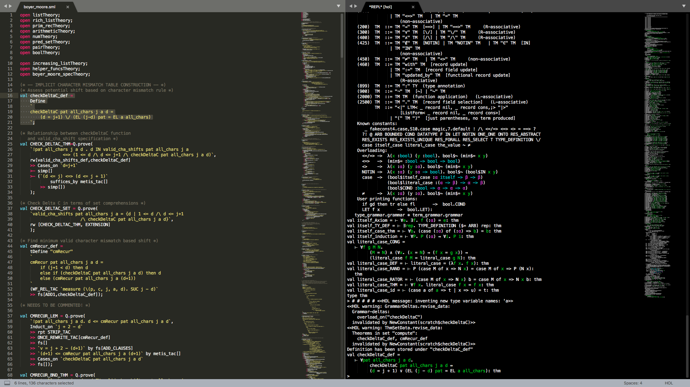

HOL for Sublime Text
=====================================

A HOL ITP (https://hol-theorem-prover.org/) development environment built on top of slimmed down, heavily modified versions of SublimeREPL (https://github.com/wuub/SublimeREPL), SublimeANSI (https://github.com/aziz/SublimeANSI), and SML-syntax (https://github.com/Takaia/SML-syntax) put together.

Features
--------
#### HOL Files
* HOL Syntax Highlighting
* Tab completion from `` \` `` to smart quote pair ``‘’``
    * Also from `` \`\` `` to ``“”``
* Unicode tab completion within HOL terms for common HOL ASCII sequences
    * Logical Symbols
        * ``!`` to ``∀``
        * ``?`` to ``∃``
        * ``~`` to ``¬``
        * ``==>`` to ``⇒``
        * ...and many more!
    * The lower case greek alphabet
        * ``'a`` to ``α``
        * ``'b`` to ``β``
        * ... and so on...
#### HOL REPL
* Unicode tab completion features in REPL entry also
* Full colour REPL (Uses HOL's ``vt100_terminal`` backend)
* Complete REPL history and scrollback
* Send selection, lines, and entire files straight to REPL in Sublime
* Automatically format selection/lines into:
    * Goals
    * Subgoals
        * Basic subgoals
        * Sufficient Condition
    * Tactics
    * Quiet mode
* Changes Flags from menus or key bindings
    * Show Types
    * Show Assums
    * Print Goal at Top
    * Print Free Variables

Installation
-------------
* You must have HOL installed and accessible through the command ``hol``
* Install the ``HOL`` package from PackageControl (https://packagecontrol.io/)
* OR clone this repository into your Packages folder and **rename it to HOL**

Usage
-------
* ``HOL`` submenu under Tools in Sublime for all the operations and their keybindings
* A right click context menu exists to kill/restart the REPL and send signals including SIGINT
* For more details and more control please see the key bindings and preference files available under the preferences menu
* Note: The terminal is speedy enough for interactive use but large imports should be done in quiet mode as they
can take some time to colourise!

License
--------
Parts of this project are under GPLv2 and parts under MIT, please see LICENSE.txt
